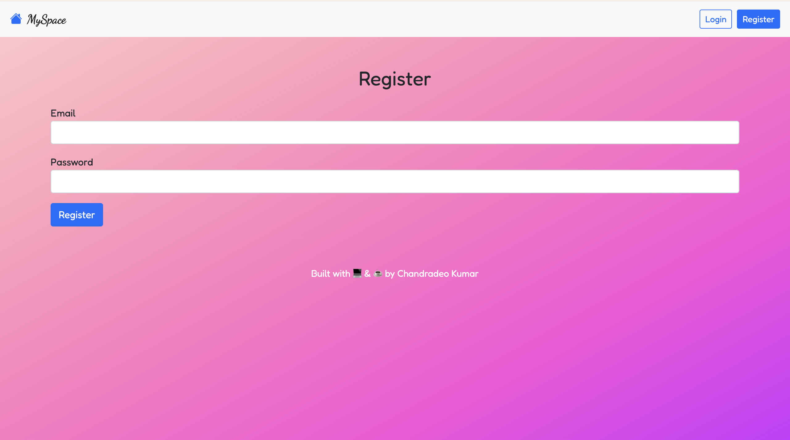
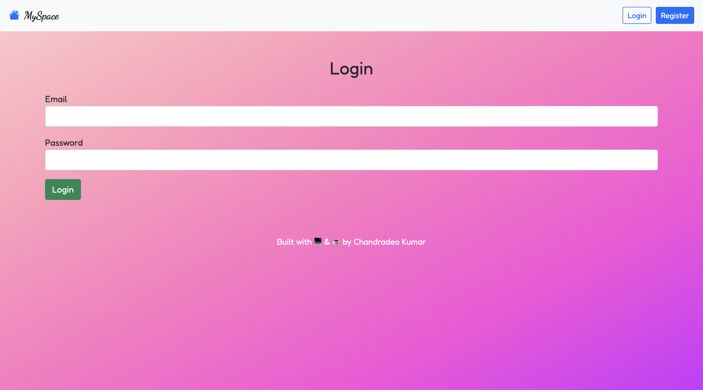
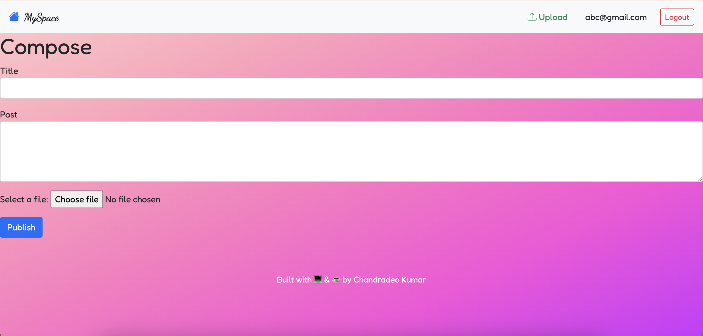
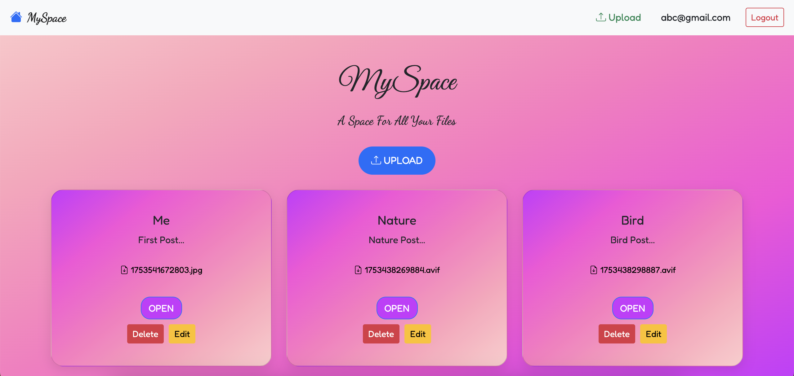

# MySpace

> A Space for All Your Files 📂

- Users can register, log in, and manage their own uploaded files.
- Only authenticated users can upload, view, edit, or delete their files.
- Each file is stored securely and only accessible to the user who uploaded it.
- File types supported: `.pdf`, `.jpg`, `.png`, `.gif`, `.mp4`, `.docx`, etc.
- Clean file preview for images and PDFs, and download support for all files.
- Implemented complete CRUD operations on uploaded files.
- RESTful routing using all HTTP methods.

---

## .env Setup Instruction

> Add a `.env` file in the root directory and configure it like this:
> MONGODB_URI=your_mongodb_connection_string
> PORT=3000

---

## Currently Live at [MySpace on Render](https://myspace-fbg4.onrender.com)

## Unauthenticated Home Page


---

## Problem Statement

**Secure File Management System**

Build a full-stack app with user authentication where users can:

- Upload files
- View a list of their uploaded files
- Edit file info or replace the file
- Download files
- Delete files

Only the file owner can perform these actions.

---

## Tech Stack Used

- HTML5
- CSS3 + Bootstrap
- JavaScript (ES6)
- Node.js
- Express.js
- EJS (Templating Engine)
- MongoDB Atlas
- Passport.js (Authentication)
- Multer (File Upload Middleware)

---

## Dependencies

- express
- mongoose
- multer
- ejs
- body-parser
- dotenv
- passport
- passport-local
- express-session
- bcrypt

---

## To Run Locally

1. Clone the repository
2. Run `npm install` to install all dependencies
3. Create `.env` file as per the setup above
4. Run the app

---

# Endpoints

Base URL: `https://myspace-fbg4.onrender.com`

---

## `/register` (Register Page)


• Form to create a new account
• Fields: Email, Password
• Automatically logs user in after registration

---

## `/login` (Login Page)


• Login form for existing users
• Session maintained until logout

---

## `/compose` (Upload Page)

> Upload a new file
> 

> This is a `POST` route that takes multiple fields for creating a file post.

- Users can upload files by clicking on the **Upload** button on the homepage.
- The form includes:
  - **Title** – the name of the file/post
  - **Description** – a short explanation of the file
  - **File** – the actual file to upload

> Once submitted, the post is saved to MongoDB with the uploaded file path and redirects to the home page.

- Accessible only when logged in
- Upload form includes title, description, and file input
- After successful upload, redirects to Home showing uploaded files

```js
{
title: req.body.post_title,
content: req.body.post_body,
file: req.file.filename
}
```

---


## `/posts/:id` (View Page)


> Displays a specific uploaded post (file).

- This route is accessible only to the **logged-in user** who created the file.
- Based on the `postId` in the URL, it retrieves and renders the corresponding post.
- The view includes:
  - **Title**
  - **Description**
  - **File Preview** (for images & PDFs)
  - **Download Button**
  - **Edit & Delete Buttons** (shown only to the file owner)
- If the file is not viewable (e.g., `.zip`, `.docx`, etc.), a fallback message is shown.

View a single uploaded post

	•	Image and PDF previews are supported inline
	•	Other formats show “Preview not available”
	•	Download, Edit, and Delete buttons are visible to the owner
   ```js
    res.render("post", {
  title: post.title,
  content: post.content,
  file: post.file,
  postId: post._id
});
```

---

## `/posts/:id/edit` (Edit Page)

> Lets users update their previously uploaded post.

- Accessible only by the **file owner**.
- Renders a pre-filled form with the existing post data.
- Users can update:
  - Title
  - Description
  - Replace file (optional)
- Upon form submission, the old file (if any) is deleted, and the updated post is saved.

Allows users to update post info or file

	•	Pre-fills the form with existing data
	•	Submitting updates the file and redirects to /posts/:id
   
   ```js
    $set: {
  title: req.body.post_title,
  content: req.body.post_body,
  file: req.file.filename
}
```

---

## `/posts/:id/delete` (Delete)

> Permanently deletes the post and its associated file.

- This route is triggered by submitting a form with method `POST`.
- Only accessible to the **owner** of the file.
- It:
  - Deletes the file from the `/uploads` folder
  - Removes the document from MongoDB
  
```js
Post.findByIdAndDelete(req.params.postId)
```

---

## `/uploads/download/:filename`

Forces file download using:
```js
res.download(filePath);
```

---

##  `/uploads/view/:filename`

Serves file inline for supported formats using:
```js
res.sendFile(filePath);
```

---

## Authentication
	•	Passport.js with Local Strategy
	•	Session management with express-session
	•	Users must log in to upload, view, edit, or delete their own files


   # Got issues or ideas? Raise them — Happy to collaborate!

